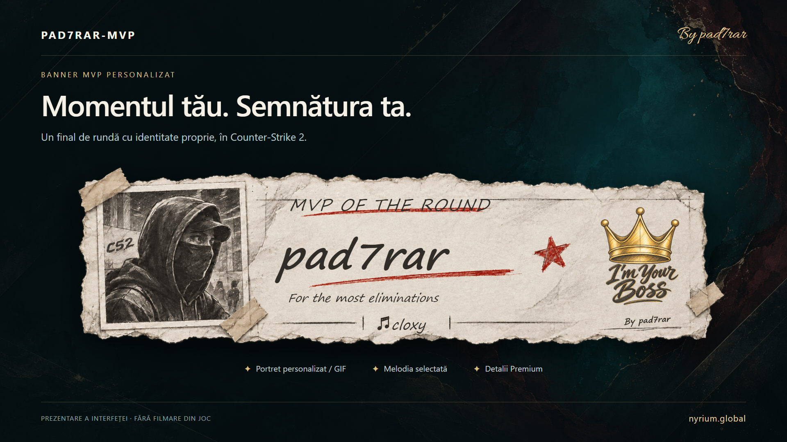

# PAD7RAR-MVP

**Your round. Your signature.**  
Muzica MVP, portrete animate si panou interactiv pentru Counter-Strike 2.

**Plugin 0.3.6** | **Nyrium Content Tools 1.0.2** | **By pad7rar**

[Instalare pas cu pas](README.txt) · [English guide](docs/PRESENTATION-EN.md) · [Discord](https://discord.gg/FmGBPWTkDP)

## Incepe aici

Acesta este repository-ul de **distributie**, nu folderul unui server.
Contine pluginul compilat, resursele clientului si utilitarul Windows pentru continut personalizat.

| Vrei sa... | Folosesti |
| --- | --- |
| Instalezi pluginul pe server | [server/game/csgo/](server/game/csgo/) |
| Publici interfata, sunetele si imaginile | [workshop/game/csgo_addons/pad7rar_mvp/](workshop/game/csgo_addons/pad7rar_mvp/) |
| Adaugi MP3/WAV/GIF proprii | [Nyrium Content Tools](tools/Nyrium-Content-Tools/) |
| Configurezi o instalare noua | [examples/config.toml](examples/config.toml) |
| Afli toate caile si ordinea instalarii | [README.txt](README.txt) |

**Server si Workshop sunt doua destinatii diferite. DLL-ul nu se publica in Workshop.**
Copierea pe server nu distribuie singura resursele jucatorilor.

## Instalare in 5 pasi

1. Pregateste un server cu Metamod, CounterStrikeSharp compatibil cu .NET 10 / CSS API 1.0.375 si [MultiAddonManager](https://github.com/Source2ZE/MultiAddonManager).
2. Publica addonul compilat din `workshop/`, sau combina resursele cu addonul tau existent si fa Re-Upload. Pastreaza resursele altor pluginuri din acel addon.
3. Cu serverul oprit, copiaza **continutul** `server/game/csgo/` peste `game/csgo/` de pe server. La actualizare pastreaza setarile si datele.
4. **Doar la prima instalare**, copiaza `examples/config.toml` in `game/csgo/addons/counterstrikesharp/configs/plugins/PAD7RAR-MVP/config.toml`. Configureaza ID-ul publicat in `mm_extra_addons`, in configuratia MultiAddonManager.
5. Porneste serverul, verifica descarcarea/montarea addonului si testeaza `!mvp`, preview-ul, GIF-ul si `!mvpbanner`.

[Ghidul complet](README.txt) explica si publicarea pe acelasi item, continutul custom, actualizarile si depanarea.
Nyrium si Workshop Tools se folosesc pe PC-ul administratorului, nu pe serverul Linux.

## Ce copiezi, exact?

| Din repository | Destinatia pe server |
| --- | --- |
| `server/game/csgo/addons/counterstrikesharp/plugins/PAD7RAR-MVP/` | `game/csgo/addons/counterstrikesharp/plugins/PAD7RAR-MVP/` |
| `server/game/csgo/addons/counterstrikesharp/shared/ClientprefsApi/` | `game/csgo/addons/counterstrikesharp/shared/ClientprefsApi/` |
| `server/game/csgo/panorama/` | `game/csgo/panorama/` |
| `server/game/csgo/sounds/` | `game/csgo/sounds/` |
| `server/game/csgo/soundevents/` | `game/csgo/soundevents/` |

Pe Pterodactyl, prefixul uzual este `/home/container/`; alte gazduiri pot avea alta radacina.
Combina directoarele, fara sa creezi accidental `game/csgo/game/csgo`.

`nyrium.json` ramane langa DLL. Catalogul custom generat de Nyrium se instaleaza in
`plugins/PAD7RAR-MVP/content/nyrium-custom.json`.
MP3-urile si GIF-urile originale nu se copiaza manual in plugin.

## Continut personalizat

Deschide **Nyrium-Content-Tools.exe**, adauga MP3/WAV/GIF, seteaza accesul si apasa **Genereaza**.
Utilitarul produce:

| Rezultat | Destinatie |
| --- | --- |
| `1-SERVER/game/csgo/` | Se combina cu `game/csgo/` de pe server; pluginul trebuie instalat deja. |
| `2-WORKSHOP/` | Resurse compilate pentru publicare prin Workshop Tools. |
| `3-PROJECT/` | Ramane pe PC impreuna cu fisierele originale, pentru actualizari. |
| `4-SUPPORT/` | Loguri de diagnostic, nu fisiere de instalare. |

La reconstruire pastreaza toate intrarile dorite in proiect. Catalogul nu se adauga automat peste cel vechi.
Un addon local nou de compilare **nu inseamna** ca trebuie creat un item Workshop nou.
Nu monta simultan addonuri care contin versiuni diferite ale acelorasi resurse MVP.

## Functii

- Biblioteca publica si continut Premium, cu acces prin permisiuni sau SteamID.
- Selectie independenta a melodiei si portretului animat.
- Preview audio, volum individual si banner personalizat la MVP.
- Preferinte locale dupa SteamID si integrare optionala Clientprefs.
- Interfata in RO, EN, RU, DE, HU, ES, PT, SR si MK.

Premium controleaza accesul prin plugin, nu confidentialitatea resurselor descarcate.
Nu include procesarea platilor.

| Comanda | Rol |
| --- | --- |
| `!mvp` | Deschide panoul. |
| `!mvpclose` | Inchide panoul. |
| `!mvpvol` | Meniu de volum. |
| `!mvplang ro` | Selecteaza limba. |
| `!mvpbanner` | Testeaza bannerul selectiei curente. |
| `css_mvpconfig_status` | Diagnostic pentru calea configuratiei, din consola. |

## Actualizarea 0.3.6

- Elimina crearea anticipata a bannerului la incarcarea hartii; pornirea serverului a fost confirmata de utilizator dupa corectie.
- Pastreaza corectia pentru configuratii fara sectiunea veche `MVPSettings`.
- Salveaza local volumul dupa SteamID, inclusiv intre harti.
- Foloseste aceeasi selectie MVP pentru banner si redarea melodiei.
- Include Nyrium 1.0.2 si banca standard recompilata pentru noua redare audio.

**Pentru melodii custom vechi, corectia audio necesita regenerare cu Nyrium 1.0.2 si Re-Upload Workshop.**
Actualizarea DLL-ului nu recompila banca de sunete a clientului.
Doar corectia DLL 0.3.6 nu necesita Re-Upload.

Verificari locale: compilare si teste automate. Publicarea Workshop si descarcarea pe un client curat
raman operatii separate de publicarea acestui repository.

## Actualizare fara pierderea datelor

Opreste serverul. Instaleaza dependentele necesare si `.deps.json`, apoi DLL-ul si resursele necesare.
Pastreaza configurarile existente (`config.toml/config.json`, `banner.json`, `nyrium.json`),
cataloagele custom, `volume-events.json` personalizat si datele jucatorilor.
Nu copia exemplul peste configuratia de productie. Reporneste dupa instalare.

Acest pachet nu include sursa C# privata, credentiale sau date de jucatori.

[Prezentare video RO](docs/media/PAD7RAR-MVP-RO-music.mp4) · [Video EN](docs/media/PAD7RAR-MVP-EN-music.mp4)

Imaginile si videoclipurile sunt materiale de prezentare, nu dovezi de testare live.
