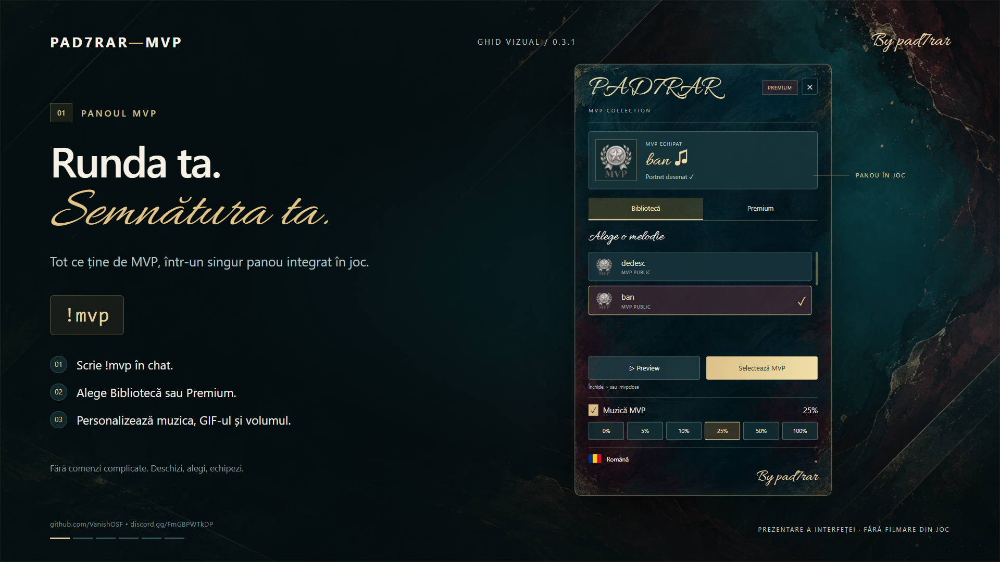

# PAD7RAR-MVP

**Your round. Your signature.**  
Muzică MVP, portrete animate și un panou interactiv pentru Counter-Strike 2.

**Versiune: 0.3.2** · **By pad7rar**  
[GitHub](https://github.com/VanishOSF/PAD7RAR-MVP) · [Discord](https://discord.gg/FmGBPWTkDP) · [English](docs/PRESENTATION-EN.md)

**Prezentare video cu muzică:** [Română](docs/media/PAD7RAR-MVP-RO-music.mp4) · [English](docs/media/PAD7RAR-MVP-EN-music.mp4)

*Prezentare a interfeței; materialul nu este o înregistrare din joc.*

## Fiecare MVP poate avea propria identitate

PAD7RAR-MVP le permite jucătorilor să aleagă melodia care se aude când câștigă MVP-ul rundei și animația care îi însoțește în banner. Selecțiile se fac dintr-un panou nativ în joc, deschis cu **`!mvp`**.

Panoul combină nuanțe de petrol, bordo și auriu cu un titlu caligrafic și un fundal cu aspect pictat. Butoanele, taburile, selecțiile și lista cu derulare sunt interactive. Bannerul de final de rundă folosește un stil separat, inspirat de desenul în creion, cu semnătura **By pad7rar**.

## Ce include

| Funcție | Ce poate face jucătorul sau administratorul |
| --- | --- |
| Bibliotecă și Premium | Navighează între conținutul public și selecțiile Premium. |
| Melodii MVP | Alege și echipează o melodie pentru momentele MVP. |
| GIF-uri | Alege separat portretul animat, independent de melodie. |
| Preview | Ascultă înainte să echipeze; un preview audio nou îl oprește pe cel anterior. |
| Control audio | Activează/dezactivează muzica și alege 0%, 5%, 10%, 25%, 50% sau 100%. |
| Banner personalizat | Afișează jucătorul MVP, melodia și portretul selectat. |
| Acces configurabil | Rezervă melodii sau GIF-uri pentru SteamID-uri și permisiuni/grupuri. |
| Limba individuală | Selectează limba din panou, cu actualizarea imediată a interfeței. |
| Conținut extensibil | Adaugă melodii și GIF-uri prin catalog și utilitar, fără recompilarea DLL-ului. |

### Muzica ta, fără suprapuneri

La un MVP custom, pluginul oprește muzica nativă de final de rundă înainte de redarea melodiei selectate, cu `DisablePlayerDefaultMVP = true`. Versiunea **0.3.2** include această corecție. Preview-urile audio se înlocuiesc între ele, iar fiecare ascultător are propriul volum.

### Premium și conținut personal

Poți crea o bibliotecă publică, o colecție Premium sau selecții private pentru anumiți jucători. Melodia și GIF-ul se echipează independent: un jucător poate combina melodia preferată cu portretul animat ales.

Premium reprezintă un nivel de acces configurabil. Pluginul nu include procesarea plăților sau un magazin automat.

### Nouă limbi

**Română, engleză, rusă, germană, maghiară, spaniolă, portugheză, sârbă și macedoneană.**

Jucătorul își alege limba din panou. Alegerea este salvată după SteamID și interfața se actualizează imediat. Până la alegerea manuală se folosește limba disponibilă prin CounterStrikeSharp; limba clientului Steam nu este detectată automat. Numele melodiilor și GIF-urilor introduse de administrator rămân cele din catalog.

## Pentru jucători

1. Scrie **`!mvp`** în chat.
2. Intră în **Bibliotecă** sau **Premium**.
3. Ascultă un preview și echipează melodia.
4. În secțiunea GIF-uri, alege separat animația.
5. Reglează volumul și limba. La următorul MVP se folosește selecția ta.

| Comandă | Rol |
| --- | --- |
| `!mvp` | Deschide panoul principal. |
| `!mvpclose` | Închide panoul. |
| `!mvpvol` | Deschide meniul de volum. |
| `!mvplang ro` | Selectează limba; coduri: en, ro, ru, de, hu, es, pt, sr, mk. |
| `!mvpbanner` | Testează bannerul selecției curente. |

## Adaugi conținut fără sursa pluginului

**Nyrium Content Tools** pregătește melodii **MP3/WAV** și animații **GIF** pentru CS2.

1. Pui fișierele în `input/` și deschizi **Nyrium-Content-Tools.exe**, sau le tragi direct în aplicație. Alegi numele, accesul public/Premium, SteamID-urile și permisiunile.
2. Selectezi instalarea CS2 și apeși **Generează**. GIF-urile sunt redimensionate automat pentru plugin. Poți salva și reîncărca proiectul pentru actualizări viitoare.
3. Copiezi catalogul și resursele generate pe server.
4. Publici sau actualizezi addonul Workshop și configurezi ID-ul în MultiAddonManager.

Jucătorii primesc resursele prin addonul Workshop configurat. Folderul `nyrium/` din plugin nu descarcă singur fișierele pe clienți. Publicarea în Workshop este un pas separat, nu o funcție automată a utilitarului.

Păstrează toate intrările custom în catalog la reconstruire. GIF-urile sunt convertite într-un atlas de 50 de cadre, la 256×256 px pe cadru; recomandăm animații scurte, pătrate, cu subiect clar.

[Ghid complet în română](tools/Nyrium-Content-Tools/CUM-ADAUGI-CONTINUT.txt) · [English content guide](tools/Nyrium-Content-Tools/README-English.txt)

## Instalare și cerințe

- Server CS2 cu Metamod și CounterStrikeSharp; build-ul este pentru **.NET 10 / CSS API 1.0.375**.
- **MultiAddonManager** și un addon Workshop configurat pentru resursele clientului.
- `ClientprefsApi.dll` este inclus în pachet; pluginul **Clientprefs** se instalează separat pentru persistența volumului.
- Pentru pregătirea conținutului: **Windows, PowerShell și CS2 Workshop Tools**.

Limba și GIF-ul se salvează local, după SteamID, fără bază de date. Volumul se aplică imediat, iar salvarea lui între sesiuni folosește Clientprefs.

Urmează [ghidul bilingv de instalare](README.txt). La actualizare, păstrează configurațiile și datele jucătorilor. Folosește folderul și DLL-ul **PAD7RAR-MVP** și evită încărcarea simultană a unei versiuni vechi.

## Conținutul pachetului

| Folder | Conținut |
| --- | --- |
| `server/` | Plugin compilat, dependențe și resurse. |
| `workshop/` | Resurse compilate pentru addonul clientului. |
| `tools/` | Aplicația Windows Nyrium Content Tools, exemplu de catalog și ghiduri. |
| `examples/` | Configurație exemplu pentru administrator. |
| `docs/` | Prezentare în engleză și instrucțiuni de actualizare. |

Pachetul nu include sursa C# a pluginului. Imaginea de prezentare și videoclipurile RO/EN sunt în `docs/media/`; colecția completă pentru site este păstrată separat.

## Versiunea 0.3.2

Corecție pentru suprapunerea muzicii native CS2 cu melodia MVP custom. [Instrucțiuni de actualizare](docs/UPDATE-0.3.2.txt).

Compilarea, încărcarea .NET și testele locale au trecut; funcționarea a fost confirmată de proprietar pe serverul său. Descărcarea completă Workshop pe un client fără resurse instalate rămâne de verificat separat.

**PAD7RAR-MVP · By pad7rar**  
[Comunitate și suport pe Discord](https://discord.gg/FmGBPWTkDP)
