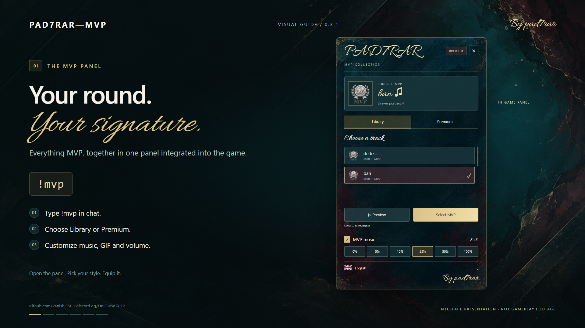
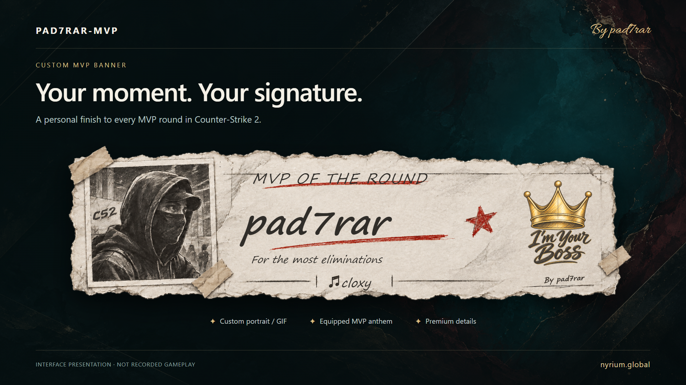

# PAD7RAR-MVP

**Your round. Your signature.**  
Custom MVP music, animated portraits and an interactive in-game panel for Counter-Strike 2.

**Version 0.3.2 · By pad7rar**  
[GitHub](https://github.com/VanishOSF/PAD7RAR-MVP) · [Discord](https://discord.gg/FmGBPWTkDP) · [Română](../README.md)

**Video presentation with music:** [English](media/PAD7RAR-MVP-EN-music.mp4) · [Română](media/PAD7RAR-MVP-RO-music.mp4)

*Interface presentation; this is not recorded gameplay.*

## Give every MVP a personal identity

Open **`!mvp`**, choose a song, equip an animated portrait and make your next MVP moment your own. Music and GIF selections are independent, so players can combine their preferred anthem with their chosen animation.

The native panel uses deep teal, burgundy and gold, a calligraphic title and painted textures. Tabs, buttons, selections and the scrollable list are interactive. A separate pencil-inspired round banner displays the MVP player, selected song and portrait, signed **By pad7rar**.

## Included features

| Feature | What it provides |
| --- | --- |
| Library and Premium | Public content alongside restricted collections. |
| Custom MVP songs | Select and equip a song for MVP rounds. |
| Animated portraits | Choose a GIF independently of the equipped song. |
| Audio previews | Listen before equipping; a new preview stops the previous one. |
| Individual volume | Music toggle and 0%, 5%, 10%, 25%, 50% or 100% volume. |
| Custom round banner | MVP identity, selected song and portrait. |
| Access rules | Restrict songs and GIFs by SteamID or permissions/groups. |
| Individual language | Change the panel language with an immediate interface refresh. |
| Custom content tools | Add songs and GIFs without rebuilding the plugin DLL. |

With `DisablePlayerDefaultMVP = true`, version **0.3.2** stops native end-of-round music before custom MVP playback. Each listener keeps their own custom volume setting, and audio previews replace one another.

Premium is a configurable access tier. Payment processing and an automatic store are not included.

## Nine languages

**English, Romanian, Russian, German, Hungarian, Spanish, Portuguese, Serbian and Macedonian.**

Players select their language in the panel. The choice is saved by SteamID and the interface updates immediately. Before a manual selection, the plugin uses the language available through CounterStrikeSharp; it does not automatically detect the Steam client's language. Administrator-defined song and GIF names are not automatically translated.

## Player workflow

1. Type **`!mvp`** in chat.
2. Browse Library or Premium.
3. Preview and equip a song.
4. Choose an animation separately in the GIF section.
5. Set your volume and language. Your selection is used for your next MVP.

| Command | Action |
| --- | --- |
| `!mvp` | Open the main panel. |
| `!mvpclose` | Close the panel. |
| `!mvpvol` | Open the volume menu. |
| `!mvplang en` | Choose a language: en, ro, ru, de, hu, es, pt, sr, mk. |
| `!mvpbanner` | Test the current selection's banner. |

## Add content without plugin source

**Nyrium Content Tools** prepares **MP3/WAV songs and GIF animations** for CS2.

Put files in `input/` and open **Nyrium-Content-Tools.exe**, or drag them into the application. Set names and access rules, select your CS2 installation and click **Build**. GIFs are resized automatically. Save and load projects to maintain your collection. Install the generated catalog and assets on the server, publish or update your Workshop addon, and configure its ID in MultiAddonManager.

Players receive the assets through the configured Workshop addon. The plugin's `nyrium/` folder alone does not distribute files to clients. Workshop publishing is a separate step, not automated by the builder.

Keep all custom entries in the catalog when rebuilding. GIFs are converted into a 50-frame atlas with 256×256-pixel frames; short, square animations with a clear subject work best.

[Full content guide](../tools/Nyrium-Content-Tools/README-English.txt)

## Requirements and installation

- CS2 server with Metamod and CounterStrikeSharp. This build targets **.NET 10 / CSS API 1.0.375**.
- **MultiAddonManager** and a configured Workshop addon for client assets.
- Included `ClientprefsApi.dll`; install the **Clientprefs plugin** separately to persist volume preferences.
- **Windows, PowerShell and CS2 Workshop Tools** for the content builder.

Language and GIF choices are stored locally by SteamID without a database. Volume changes apply immediately; persistence across sessions uses Clientprefs.

Follow the [bilingual installation guide](../README.txt). Preserve settings and player data when upgrading. Use the **PAD7RAR-MVP** folder and DLL, without loading an old installation alongside it.

## Package layout

| Folder | Contents |
| --- | --- |
| `server/` | Compiled plugin, dependencies and resources. |
| `workshop/` | Compiled client addon resources. |
| `tools/` | Nyrium Content Tools Windows application, example catalog and guides. |
| `examples/` | Example server configuration. |
| `docs/` | Presentation and update instructions. |

The distribution does not include the plugin's C# source. Presentation images and RO/EN videos are in `docs/media/`; the full website media collection is kept separately.

## Version 0.3.2

Fix for overlapping native CS2 music and custom MVP playback. [Update instructions](UPDATE-0.3.2.txt).

Build, .NET loading and local tests passed. The owner confirmed operation on their server. End-to-end Workshop downloading on a client without preinstalled assets still requires separate verification.

**PAD7RAR-MVP · By pad7rar**  
[Community and support on Discord](https://discord.gg/FmGBPWTkDP)
